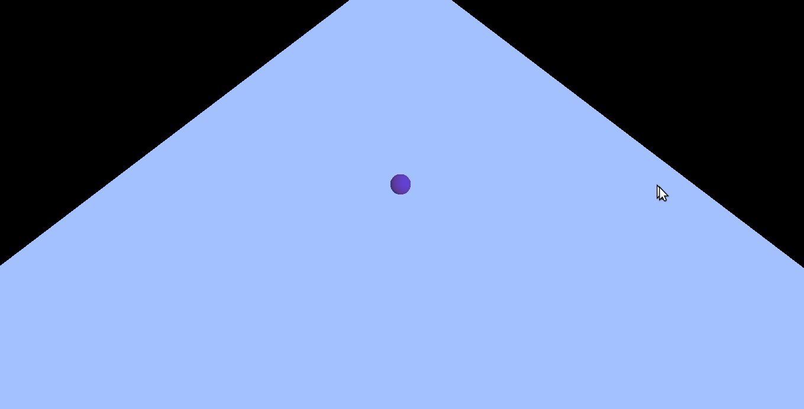

# RG165-BeTheBachelor

## Intro

>Projekat u okviru kursa Računarska grafika, 
na Matematičkom fakultetu.
>Projekat je trenutno u fazi izrade i u narednom
periodu biće izvršen veliki broj izmena i popravki
na istom.

## Opis
> U osnovi, ovo je mala igrica/animacija
gde je neophodno da igrač korišćenjem komandi
sa tastature se kreće duž ploče ostajući što
duže na istoj u nadi da će doći do kraja
i završiti osnovne studije.

## Instalacija :construction:
>- Potrebno je na računari imati GL/glut biblioteke kako 
bi mogli kompilirati izvorne datoteke. 
>- Instalacija biblioteka `sudo apt-get install binutils-gold freeglut3 freeglut3-dev `
>- Nakon što preuzmete ceo repozitorijum 
neophodno je da se pozicionirate u koreni
direktorijum projekta i kucanjem komandi:
`mkdir build`   'cd build' 
    `cmake ..`    `make`  
kreiraće se izvršiva datoteka.

## Komande  :video_game:
>* <button>w</button> &nbsp;&nbsp; Start
>* <button>a</button> , <button>d</button> &nbsp;&nbsp;Levo-desno kretanje
>* <button>x</button>&nbsp;&nbsp; Zaustavljanje figurice
>* <button>q</button>&nbsp;&nbsp; Skok

## Prikaz

---

### Dodatno
>Za sam tok izrade projekta pratiti 
[wiki](https://github.com/MATF-RG18/RG165-bethebachelor/wiki/Izve%C5%A1taji) 
stranicu projekta.
