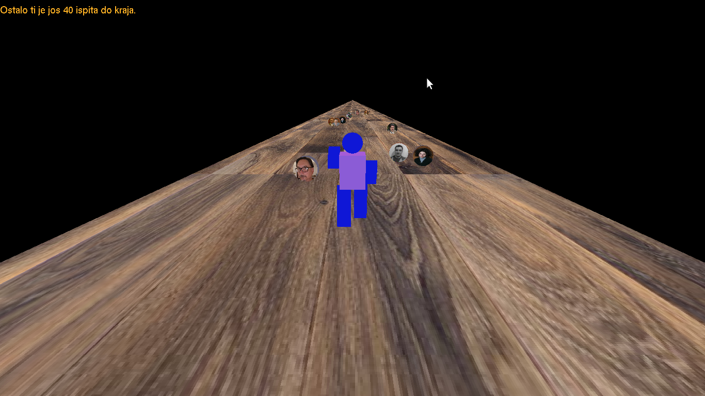

# RG165-BeTheBachelor

## Intro

>Projekat u okviru kursa Računarska grafika, 
na Matematičkom fakultetu.
>Projekat je trenutno u fazi izrade i u narednom
periodu biće izvršen veliki broj izmena i popravki
na istom.

## Opis
> U osnovi, ovo je mala igrica/animacija
gde je neophodno da igrač korišćenjem komandi
sa tastature se kreće duž ploče u nadi da će skupiti
sve tokene sa slikama profesora koji predaju
neki ispit na fakultetu i doći do kraja
(završiti osnovne studije)  
> Sama igra se sastoji od 4 nivoa, sa predmetima
po svakoj godini. U sledeći nivo se prelazi
tek nakon što se očisti cela godina (nije kao
u stvarnosti :( ), na svakom sledećem nivou
igrač se kreće brže. Naravno neophodno je 
sve to uraditi što ranije jer dug prema
fakultetu raste.  
> U toku treće godine se pojavljuje u vazduhu
greda sa likom Bobana(nije Boban nego crnogorski 
glumac Slavko Labović jer nisam uspeo da 
nađem sliku Bobana iz studentske). Ako uspeš
da se održiš na gredi do kraja grede Boban će
ti sa hipatije obrisati pola duga, ali isto tako 
ako udariš u gredu završio si svoje studije.

## Instalacija :construction:
>- Potrebno je na računari imati GL/glut biblioteke kao i alat cmake kako 
biste mogli kompilirati izvorne datoteke. 
>- Instalacija biblioteka `sudo apt-get install binutils-gold freeglut3 freeglut3-dev `
>- Nakon što preuzmete ceo repozitorijum 
neophodno je da se pozicionirate u koreni
direktorijum projekta i kucanjem komandi:  
`mkdir build`   `cd build` 
    `cmake ..`    `make`  
kreiraće se izvršiva datoteka.

## Komande  :video_game:
>* <button>w</button> &nbsp;&nbsp; Pokretni kretanje
>* <button>a</button> , <button>d</button> &nbsp;&nbsp;Levo-desno kretanje
>* <button>x</button>&nbsp;&nbsp; Zaustavljanje figurice
>* <button>q</button>&nbsp;&nbsp; Skok
>* <button>esc</button>&nbsp;&nbsp; Izlaz u bilo kom momentu
>* <button>Enter</button>&nbsp;&nbsp; Start
>* <button>Space</button>&nbsp;&nbsp; Turbo

## Prikaz

---

### Dodatno
>Za sam tok izrade projekta pratiti 
[wiki](https://github.com/MATF-RG18/RG165-bethebachelor/wiki/Izve%C5%A1taji) 
stranicu projekta.
